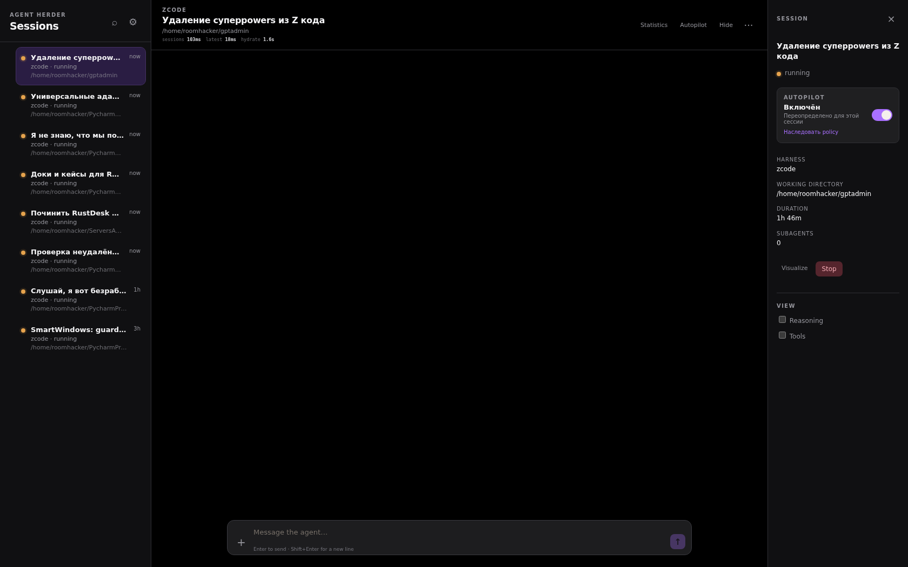
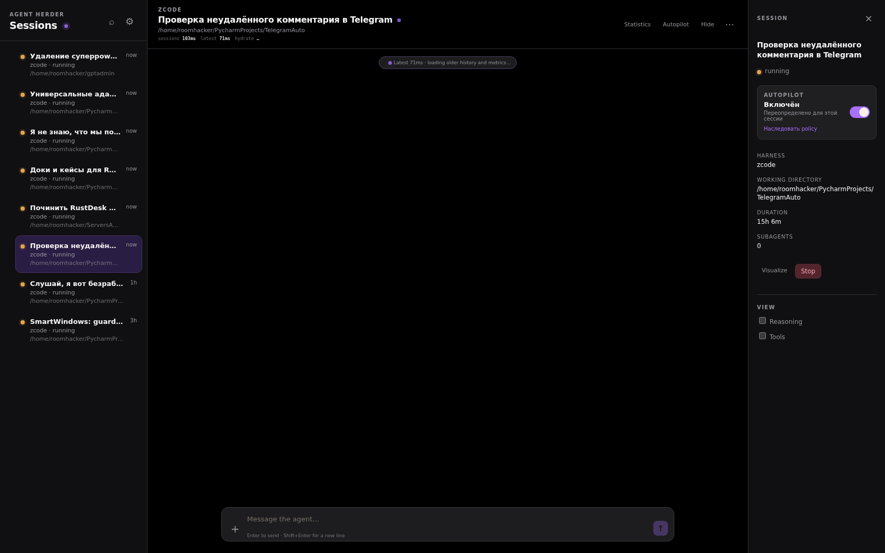
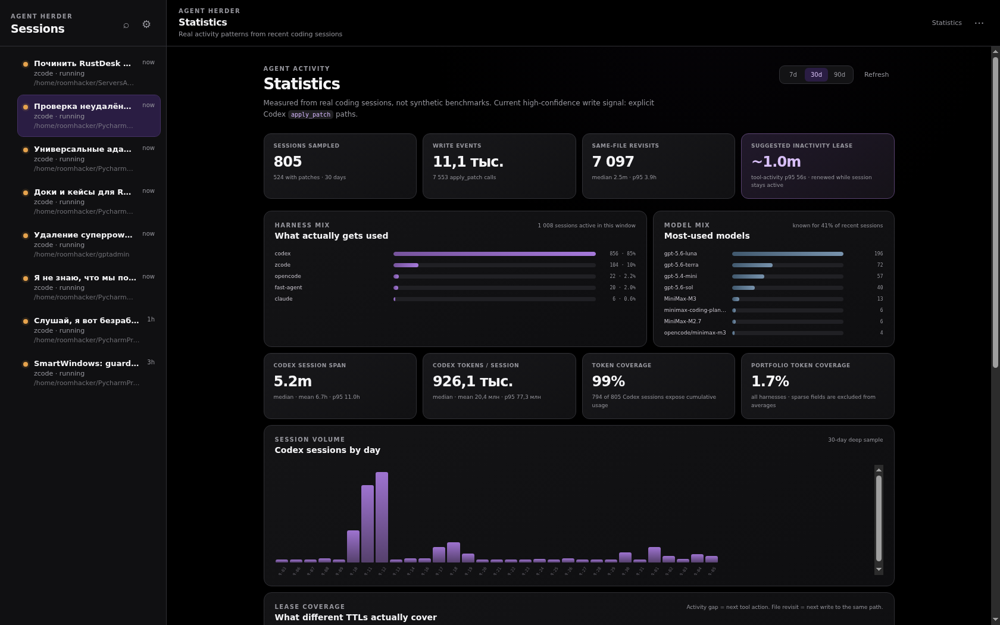

# Agent Herder

**MCP control center for coding agents — and the missing inter-agent messenger.**

Monitor, inspect, and coordinate AI coding sessions — and message them — from one **MCP server**: OpenCode, Claude Code, Codex CLI, Qoder, ZCode, and Fast Agent.
Sessions keep living in their own harnesses; Agent Herder gives them a shared
control plane, a shared presence ledger, and a shared inbox.

[Русский](README.ru.md) · [简体中文](README.zh.md)


## Start in 30 seconds

Run it without cloning a repository:

```bash
npx -y agent-herder
```

Add the same command to any MCP client:

```json
{
  "mcpServers": {
    "agent-herder": {
      "command": "npx",
      "args": ["-y", "agent-herder"]
    }
  }
}
```

Start the harness you want to observe first. For OpenCode, that means:

```bash
opencode serve
```

## What it actually does

**One control plane, three layers.**

### 1. Observe — every session, every harness, one list

- Running / idle / stopped / waiting sessions across OpenCode, Claude Code,
  Codex CLI, Qoder, ZCode, and Fast Agent.
- Liveness you can trust: a hook-fed lifecycle registry observes real session
  events (start, turn start, turn end, session end) and beats the stale
  status that task indexes keep for interactive sessions. Recency heuristics
  are the fallback, observed state is the truth.
- Parent/child lineage without guessing IDs, raw transcript export with a
  navigation card, worktree audits, model inventory.

### 2. Message — agents talk to agents (and to you)

- `send_message` delivers into a target session with `queue`, `steer`, or
  `sync` semantics — and **wakes it up**. A parked ZCode session would
  otherwise never execute a queued prompt; Agent Herder resumes the target so
  the message actually runs.
- `fromSessionId` / `fromHarness` wrap every delivery in a reply header:
  *who sent this* and *the exact call to answer*. No id hunting.
- Idle interactive sessions that reject direct prompts are auto-resumed on
  delivery.
- `respond_permission` answers tool-permission requests remotely — this is
  how headless agents get unstuck while nobody is watching.

Verified live: two headless ZCode sessions created, tasked with a
conversation, exchanging multiple messages each through `send_message`, and
finishing with `CHAT-DONE` — zero human input after the initial kick.

## Screenshots

Live web UI against real workloads — several harnesses, dozens of parallel
sessions, one board.


*Session roster: running agents across workspaces with autopilot toggles,
durations, and a message composer per session.*


*Session detail: conversation view, autopilot switch, stop/visualize
controls, and a message composer.*


*Statistics: 805 sessions sampled, 11.1k write events, harness and model
mix, token coverage, and session-volume histograms measured from real
coding sessions.*

### 3. Coordinate — repo boards, only-new-information injections

Every workspace gets a coordination **board** keyed by the git repo that owns
the touched files. A session editing across three repos appears on three
boards.

- **Auto-reserve on file activity**: harness hooks report each edited file;
  the board records who touches what. Conflicts with another agent's paths
  come back as a soft-lock warning before the edit lands.
- **Peers roster**: on every file edit the hook may inject "other agents
  recently active in this repo, and how to contact them".
- **Task declaration**: a session that has not declared what it is working on
  receives a one-line directive to publish a `working` note — so a pair of
  agents never trip over each other silently.
- **Session-end purge**: when a session wraps up, its Stop hook drops its
  leases and presence from every board immediately. Dead agents disappear
  from rosters instead of haunting them until a TTL expires.
- **Injection dedup**: every injection channel (turn-start notes,
  file-activity rosters, delivered messages) shares one per-session,
  per-board signature slot. A session only ever receives a block when the
  roster materially changed — TTL refreshes and id churn are invisible — or
  after a staleness window (`AGENT_HERDER_INJECTION_RESHOW_MS`, default 45
  minutes) that covers context compaction.

Manual notes work too: `coordination_note_create` with a TTL, editable and
deletable by the author, auto-pruned on expiry.

## Supported harnesses

| Harness | Connection | Enablement |
|---|---|---|
| OpenCode | HTTP API | Enabled by default; run `opencode serve` |
| Claude Code | SDK/CLI, current and legacy session files, native `/autopilot` + `Stop` plugin | Enabled by default |
| Codex CLI | Native app-server with CLI fallback, plugin `Stop` judge | Enabled by default |
| Qoder CLI | Native ACP | Set `ENABLE_QODER=true` |
| ZCode | Local stdio ZCode Protocol app-server, native `Stop`/`SessionStart`/`UserPromptSubmit`/`PreToolUse`/`PostToolUse`/`SessionEnd` hooks | Enabled by default |
| Fast Agent | Persisted session home + CLI resume/send | Set `ENABLE_FAST_AGENT=true` and `FAST_AGENT_HOME` |

## Core MCP tools

| Group | Tools |
|---|---|
| Discover | `list_agents`, `agent_info`, `audit_worktrees` |
| Lineage and transcript | `find_parent`, `list_children`, `export_transcript` |
| Named sessions | `create_session`, `new_or_resume` (OpenCode, Codex, and ZCode) |
| Control | `send_message` (queue / steer / sync, reply header via `fromSessionId`), `resume_agent`, `stop_agent` |
| Coordination | `coordination_note_create`, `coordination_note_list`, `coordination_note_get`, `coordination_note_update`, `coordination_note_delete` |
| Permissions and models | `respond_permission`, `set_permissions`, `list_models`, `change_model` |

## Architecture notes

- **Singleton daemon.** One Agent Herder process per host holds the state and
  serves the web UI plus MCP over HTTP (`AGENT_HERDER_WEB_PORT`, default
  loopback `18787`). Harness processes either run the stdio entrypoint or the
  bundled `http-mcp-stdio.js` shim / direct HTTP entry that forwards to the
  singleton.
- **ZCode adapter.** Talks the native ZCode Protocol app-server (length-
  framed channel protocol, `zcode-agent` / `zcode-task` namespaces), and
  attributes every protocol call to the right workspace (`workspaceKey`).
- **ZCode plugin** (`integrations/zcode/agent-herder-autopilot`): native hooks
  for `SessionStart`, `UserPromptSubmit`, `PreToolUse`, `PostToolUse`,
  `Stop`, and `SessionEnd` — feeding lifecycle and file-activity events —
  plus the autopilot `Stop` judge (continue the session, ask the human via a
  durable choice registry, or wrap up and purge).
- **Codex plugin** (`.codex-plugin`): native `Stop` judge with the same
  continue-or-notify contract.
- **Claude Code autopilot** is packaged under `.claude-plugin/`: `/autopilot`
  toggles the exact current session, the native `Stop` hook asks the shared
  AI judge to continue or finish, and ambiguous decisions appear as
  NoticePlace/web buttons. See [the autopilot guide](docs/autopilot.md).

## Requirements

- Node.js 22+ and npm.
- At least one supported harness installed and available in `PATH`.
- `OPENAI_API_KEY` for Codex when the Codex app-server requires it.

## Configuration

The common switches are:

| Variable | Default | Purpose |
|---|---:|---|
| `ENABLE_OPENCODE` | `true` | Enable the OpenCode adapter |
| `ENABLE_CLAUDE` | `true` | Enable the Claude Code adapter |
| `ENABLE_CODEX` | `true` | Enable the Codex adapter |
| `ENABLE_QODER` | `false` | Enable the Qoder ACP adapter |
| `ENABLE_ZCODE` | `true` | Enable the local ZCode app-server adapter |
| `ENABLE_FAST_AGENT` | `false` | Enable the read-only persisted fast-agent observer |
| `OPENCODE_URL` | `http://127.0.0.1:4096` | OpenCode server URL |
| `CODEX_TRANSPORT` | `app-server` | Codex native transport or `cli` fallback |
| `ZCODE_SERVER_NODE` / `ZCODE_SERVER_ENTRY` | `~/.zcode/server/…` when present | ZCode stdio app-server runtime |
| `ZCODE_BIN` / `ZCODE_ARGS` | `zcode` / `["app-server"]` | Fallback command when the bundled server entrypoint is unavailable |
| `ZCODE_TASKS_INDEX_DB` | `~/.zcode/v2/tasks-index.sqlite` | Cross-workspace discovery source for ZCode sessions |
| `AGENT_HERDER_COORDINATION_NOTES` | `~/.local/state/agent-herder/coordination-notes.json` | Shared coordination board store |
| `AGENT_HERDER_INJECTION_RESHOW_MS` | `2700000` | Re-inject unchanged rosters after this staleness window |
| `AGENT_HERDER_AUTO_TTL_SECONDS` | `60` | Auto-reserved file-activity lease TTL |
| `AGENT_HERDER_WEB_PORT` | — | Serve the web UI + MCP over HTTP (singleton daemon mode) |
| `AGENT_HERDER_HTTP_TOKEN` | — | Required when the web host is non-loopback |
| `AGENT_HERDER_TRANSCRIPT_ARCHIVE_DIR` | `.agent-herder/transcripts` | Relative archive path inside the MCP process CWD |

## Develop locally

```bash
npm ci
npm test
npm run build
npm run inspect
```

The local stdio entrypoint is `dist/index.js`; the HTTP-forwarding stdio shim
for harness processes is `dist/http-mcp-stdio.js`.

<details>
<summary>Advanced: web UI and persistent ACP</summary>

The optional web UI runs on loopback:

```bash
export AGENT_HERDER_WEB_PORT=8787
npm start
```

Open `http://127.0.0.1:8787/`. For a persistent ACP profile, set
`ACP_AGENT_COMMAND`, `ACP_AGENT_ARGS` as a JSON array, and
`ACP_AGENT_PROFILE` before starting the server.
Set `AGENT_HERDER_WEB_PORT` to the loopback upstream expected by your reverse
proxy (the managed `agent.bezrabotnyi.com` deployment uses `18787`).
The matching user-service template is
[`deploy/systemd/agent-herder.service`](deploy/systemd/agent-herder.service).

</details>

## FAQ

**Does Agent Herder replace my coding agent?** No. It connects your MCP client
to the sessions owned by OpenCode, Claude Code, Codex, Qoder, ZCode, or Fast
Agent — and adds the messenger layer between them.

**Do agents need the herder MCP to receive messages?** No. Delivery goes
through the harness itself (native prompt injection). The herder MCP on the
agent side is only needed to *send* and to manage notes.

**Why do headless ZCode sessions stop to ask for permission?** Harness
policy, not the herder: each tool call can require an approval. Approve
remotely with `respond_permission` (`remember: true` scopes the grant); the
grant lives in the app-server process, so daemon restarts clear it.

**Does `export_transcript` load everything into the model?** No. It writes the
raw source to a CWD-scoped archive and returns only the permanent navigation
card.

**Can I use only one harness?** Yes. Disable adapters you do not run with the
`ENABLE_*` variables.

## License

MIT
