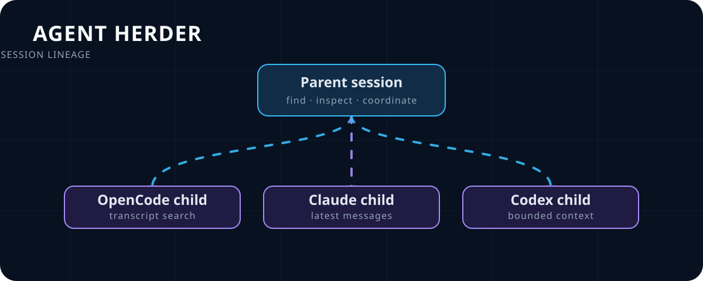

# Agent Herder

**MCP-центр управления AI-агентами для разработки.**

Agent Herder объединяет OpenCode, Claude Code, Codex CLI и Qoder в один
интерфейс: показывает сессии и помогает управлять агентами.

[English](README.md) · **Русский** · [简体中文](README.zh.md)



## Запуск за 30 секунд

Без клонирования репозитория:

```bash
npx -y agent-herder
```

Для любого MCP-клиента используйте ту же команду:

```json
{
  "mcpServers": {
    "agent-herder": {
      "command": "npx",
      "args": ["-y", "agent-herder"]
    }
  }
}
```

Сначала запустите нужный harness. Для OpenCode:

```bash
opencode serve
```

## Что умеет Agent Herder

- показывает работающие, ожидающие и остановленные сессии;
- находит родителя и детей сессии по настоящей lineage-связи;
- отправляет сообщения, возобновляет, останавливает и восстанавливает агентов;
- управляет permissions, моделями и worktree.

Пример запроса агенту:

> Найди родителя этой сессии, перечисли детей и экспортируй raw-транскрипт
> ребёнка, который сейчас чинит ошибку.

## Поддерживаемые harnesses

| Harness | Как подключается | Включение |
|---|---|---|
| OpenCode | HTTP API | Включён по умолчанию, нужен `opencode serve` |
| Claude Code | SDK/CLI и файлы сессий | Включён по умолчанию |
| Codex CLI | Native app-server и CLI fallback | Включён по умолчанию |
| Qoder CLI | Native ACP | `ENABLE_QODER=true` |

## Инструменты MCP

| Задача | Инструменты |
|---|---|
| Найти сессии | `list_agents`, `agent_info`, `audit_worktrees` |
| Родители и транскрипт | `find_parent`, `list_children`, `export_transcript` |
| Именованные сессии | `create_session`, `new_or_resume` (OpenCode и Codex) |
| Управление | `send_message`, `resume_agent`, `stop_agent` |
| Permissions и модели | `respond_permission`, `set_permissions`, `list_models`, `change_model` |

`export_transcript` копирует raw-транскрипт адаптера для одной сессии и её
родителей/детей внутри рабочего каталога, а затем всегда возвращает короткую
навигационную карточку. Он намеренно не ранжирует и не сжимает диалог: агент
сам берёт ровно нужный срез обычными файловыми инструментами.

`new_or_resume` использует точный ключ `(harness, canonical CWD, name)`: одну
найденную native-сессию продолжает, при отсутствии создаёт и затем доставляет
одно сообщение. Несколько точных совпадений дают ошибку до отправки. Режим
`queue` подтверждает native acceptance, `sync` ждёт ответ адаптера; дедупликация
событий остаётся обязанностью вызывающего webhook/control plane.

## Требования

- Node.js 22+ и npm;
- установлен хотя бы один поддерживаемый harness;
- `OPENAI_API_KEY` для Codex, если его app-server этого требует.

## Конфигурация

| Переменная | По умолчанию | Назначение |
|---|---:|---|
| `ENABLE_OPENCODE` | `true` | включить OpenCode |
| `ENABLE_CLAUDE` | `true` | включить Claude Code |
| `ENABLE_CODEX` | `true` | включить Codex |
| `ENABLE_QODER` | `false` | включить Qoder ACP |
| `OPENCODE_URL` | `http://127.0.0.1:4096` | URL OpenCode |
| `CODEX_TRANSPORT` | `app-server` | native transport или `cli` fallback |
| `QODER_CWD` | текущий каталог | рабочая папка Qoder |
| `AGENT_HERDER_TRANSCRIPT_ARCHIVE_DIR` | `.agent-herder/transcripts` | относительный путь архива внутри CWD MCP-процесса |
| `AGENT_HERDER_TRANSCRIPT_ARCHIVE_MAX_BYTES` | `104857600` | лимит архива, 100 MiB |
| `AGENT_HERDER_TRANSCRIPT_ARCHIVE_RETENTION_DAYS` | `3` | удалить не менявшиеся bundles по времени изменения |

Пример для Qoder:

```bash
export ENABLE_QODER=true
export QODER_CWD=/path/to/project
npx -y agent-herder
```

## Разработка

```bash
npm ci
npm test
npm run build
npm run inspect
```

Локальная stdio-точка входа: `dist/index.js`.

## Частые вопросы

**Agent Herder заменяет моего coding-агента?** Нет. Он подключает MCP-клиент
к уже существующим сессиям OpenCode, Claude Code, Codex или Qoder.

**`export_transcript` загружает всю историю в модель?** Нет. Он сохраняет raw
источник в CWD-ограниченный архив и возвращает только постоянную карточку
навигации: `sed` для начала, `tail` для конца, `rg` для текста, regex и времени.

**Можно оставить только один harness?** Да, отключите ненужные адаптеры через
переменные `ENABLE_*`.

## Архив транскриптов

`export_transcript` атомарно копирует raw-источник адаптера под CWD
MCP-процесса и создаёт рядом manifest lineage. Display-текст никогда не служит
fallback для архива. Manifest содержит источник, формат, покрытие timestamps и
подтверждённую полноту; родители и дети за пределами CWD только отмечаются как
исключённые.

Карточка навигации возвращается для каждого экспорта независимо от размера
транскрипта. В ней есть примеры для первых/последних строк и поиска обычного
текста, регулярного выражения и времени. Архивы OpenCode и ACP явно частичные,
пока upstream не предоставляет проверенную полную историю.

## Лицензия

MIT
