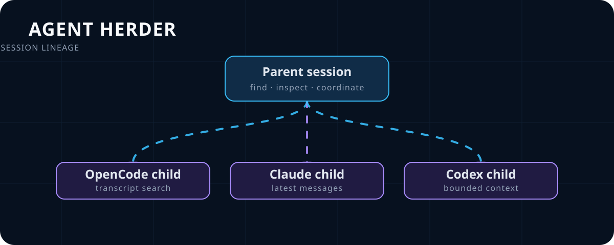
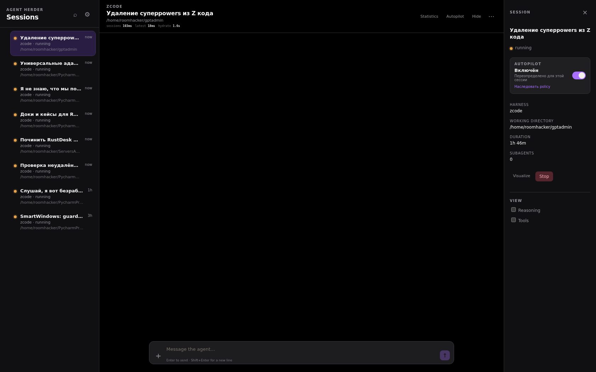
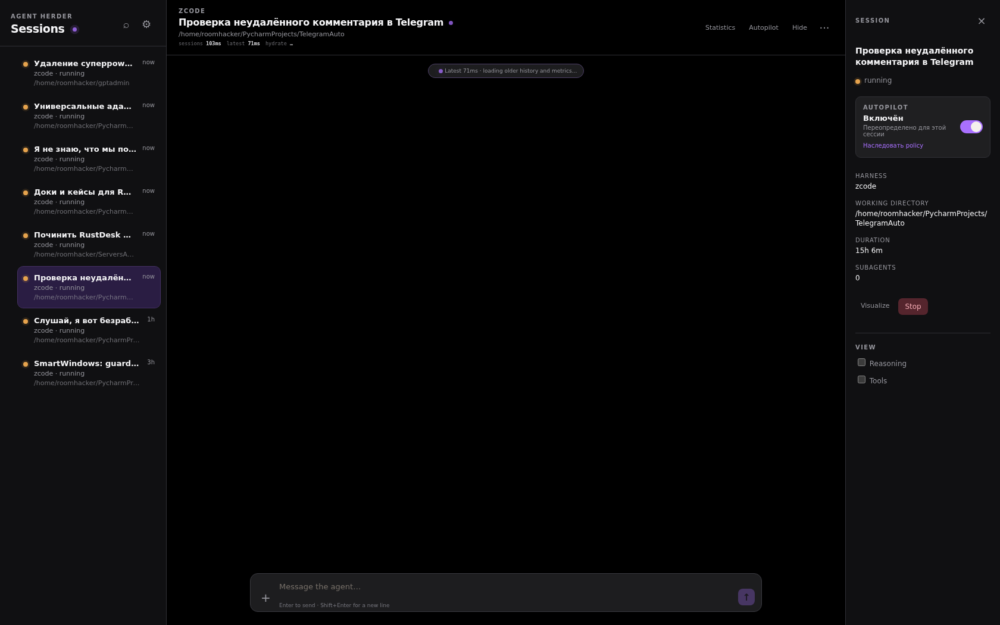
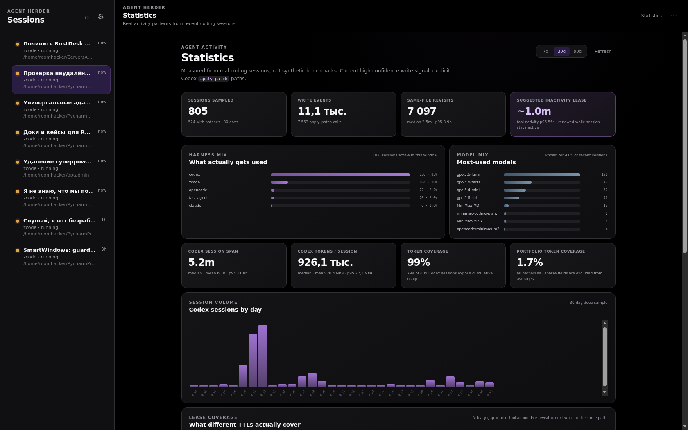

# Agent Herder

**MCP-центр управления AI-агентами — и недостающий мессенджер между ними.**

Наблюдай, инспектируй, пиши и координируй сессии AI-агентов через один
MCP-сервер: OpenCode, Claude Code, Codex CLI, Qoder, ZCode и Fast Agent.
Сессии живут в своих харнесах — Agent Herder даёт им общий пульт управления,
общий реестр присутствия и общий почтовый ящик.

[English](README.md) · **Русский** · [简体中文](README.zh.md)



## Запуск за 30 секунд

```bash
npx -y agent-herder
```

Подключение к любому MCP-клиенту:

```json
{
  "mcpServers": {
    "agent-herder": {
      "command": "npx",
      "args": ["-y", "agent-herder"]
    }
  }
}
```

## Три слоя возможностей

### 1. Наблюдение — все сессии всех харнесов в одном списке

- Running / idle / stopped / waiting по OpenCode, Claude Code, Codex CLI,
  Qoder, ZCode и Fast Agent.
- Достоверная живость: реестр жизненного цикла питается хуками (старт сессии,
  границы ходов, конец сессии) и честнее устаревшего статуса из индексов
  задач. Эвристика по свежести `updatedAt` — только фолбэк.
- Родственные связи сессий без угадывания id, экспорт сырых транскриптов с
  навигационной карточкой, аудит worktree, инвентарь моделей.

### 2. Переписка — агенты говорят друг с другом (и с тобой)

- `send_message` доставляет в целевую сессию с семантикой `queue` / `steer` /
  `sync` — и **будит** её: припаркованная ZCode-сессия сама бы никогда не
  исполнила сообщение из очереди, herder делает resume, и сообщение
  выполняется.
- `fromSessionId` / `fromHarness` оборачивают доставку шапкой: *кто прислал* и
  *точный вызов для ответа*. Никакого выслеживания id.
- Idle-интерактивные сессии, отклоняющие прямой промпт, автоматически
  возобновляются при доставке.
- Незавершённый ход переживает перезапуск Agent Herder. Это отдельная от
  автопилота opt-out настройка: по умолчанию она включена, запоминает только
  реально начатый ход и до истечения provider-cache TTL продолжает ту же
  сессию тем же харнесом и моделью. После TTL она может создать новую сессию с
  кратким handoff; это обычный сохраняемый переключатель Autocontinue, по
  умолчанию включённый. Глобальное отключение:
  `AGENT_HERDER_UNFINISHED_AUTOSTART=false`; в Web UI Autocontinue имеет
  отдельные master, harness и per-session настройки и не включает Autopilot.
- `respond_permission` удалённо одобряет запросы прав — так headless-агенты
  выходят из затыка без человека.

Проверено живьём: два headless-агента в ZCode, созданные через herder,
обменялись несколькими сообщениями через `send_message` и завершились
`CHAT-DONE` — без единого действия человека после стартового пинка.

## Скриншоты

Живой веб-интерфейс на реальной нагрузке — несколько харнесов, десятки
параллельных сессий, одна доска.


*Ростер: работающие агенты across воркспейсов, тумблеры автопилота,
длительности и композер сообщений.*


*Детали сессии: переписка, тумблер автопилота, stop/visualize и композер.*


*Статистика: 805 сессий в выборке, 11,1 тыс. write-событий, микс харнесов и
моделей, покрытие токенами и гистограммы объёма сессий.*

### 3. Координация — доски по репозиториям, инжект только нового

Каждый воркспейс получает координационную **доску**, привязанную к git-репо
правленных файлов. Сессия, правящая три репо, видна на трёх досках.

- **Авто-резерв по файловой активности**: хуки докладывают каждый правленный
  файл; доска помнит, кто что трогает. Конфликты путей с другим агентом
  возвращаются soft-lock предупреждением до того, как правка уедет.
- **Ростер пиров**: при правке файла хук может вложить блок «кто ещё работает
  в этом репо и как с ним связаться».
- **Декларация задачи**: сессия без собственной заметки получает директиву
  одной строкой — опубликуй `working`-ноту, чем занимаешься.
- **Зачистка по концу сессии**: Stop-хук завершившейся сессии снимает её лизы
  и присутствие со всех досок немедленно.
- **Дедуп инжектов**: все каналы (заметки на старте хода, ростеры по
  активности, доставленные сообщения) делят один сигнатурный слот на сессию
  и доску. Сессия получает блок только при реальном изменении ростера —
  обновления TTL и churn id невидимы — либо после окна устаревания
  (`AGENT_HERDER_INJECTION_RESHOW_MS`, 45 минут) на случай компакции
  контекста.

Ручные заметки тоже работают: `coordination_note_create` с TTL, автор может
обновлять и удалять, просроченные чистятся автоматически.

## Поддерживаемые харнесы

| Харнес | Подключение | Включение |
|---|---|---|
| OpenCode | HTTP API | По умолчанию; нужен `opencode serve` |
| Claude Code | SDK/CLI + нативный `/autopilot` и `Stop`-плагин | По умолчанию |
| Codex CLI | Нативный app-server + плагин-джадж на `Stop` | По умолчанию |
| Qoder CLI | Нативный ACP | `ENABLE_QODER=true` |
| ZCode | Локальный stdio ZCode Protocol app-server + нативные хуки жизненного цикла | По умолчанию |
| Fast Agent | Persisted session home + CLI resume/send | `ENABLE_FAST_AGENT=true` |

## Основные MCP-тулы

| Группа | Тулы |
|---|---|
| Обнаружение | `list_agents`, `agent_info`, `audit_worktrees` |
| Линидж и транскрипты | `find_parent`, `list_children`, `export_transcript` |
| Именованные сессии | `create_session`, `new_or_resume` (OpenCode, Codex, ZCode) |
| Управление | `send_message` (queue / steer / sync, шапка ответа через `fromSessionId`), `resume_agent`, `stop_agent` |
| Координация | `coordination_note_create/list/get/update/delete` |
| Права и модели | `respond_permission`, `set_permissions`, `list_models`, `change_model` |

## Заметки об архитектуре

- **Синглтон-демон.** Один процесс на хост держит состояние, web UI и MCP
  поверх HTTP (`AGENT_HERDER_WEB_PORT`, loopback `18787`). Процессы харнесов
  используют stdio-вход или `http-mcp-stdio.js`-шим, пересылающий вызовы
  демону.
- **ZCode-адаптер.** Говорит на нативном ZCode Protocol app-server
  (length-framed протокол, каналы `zcode-agent` / `zcode-task`) и привязывает
  каждый вызов к нужному воркспейсу (`workspaceKey`).
- **ZCode-плагин** (`integrations/zcode/agent-herder-autopilot`): нативные
  хуки `SessionStart`, `UserPromptSubmit`, `PreToolUse`, `PostToolUse`,
  `Stop`, `SessionEnd` — питают lifecycle и файловую активность; плюс
  autopilot-джадж на `Stop` (продолжить / спросить человека через durable
  choice registry / завершить и зачистить).
- **Codex-плагин** (`.codex-plugin`): нативный `Stop`-джадж с тем же
  контрактом «продолжить или уведомить».
- **Claude Code autopilot** — под `.claude-plugin/`: `/autopilot`, `Stop`-джадж,
  неоднозначные решения через NoticePlace/web-кнопки.
  См. [docs/autopilot.md](docs/autopilot.md).

## Требования

- Node.js 22+ и npm.
- Минимум один поддерживаемый харнес в `PATH`.
- `OPENAI_API_KEY` для Codex, если app-server его требует.

## Ключевые переменные окружения

| Переменная | По умолчанию | Назначение |
|---|---:|---|
| `ENABLE_OPENCODE` / `ENABLE_CLAUDE` / `ENABLE_CODEX` | `true` | Адаптеры |
| `ENABLE_QODER` / `ENABLE_FAST_AGENT` | `false` | Доп. адаптеры |
| `ZCODE_SERVER_NODE` / `ZCODE_SERVER_ENTRY` | `~/.zcode/server/…` | Рантайм ZCode app-server |
| `ZCODE_TASKS_INDEX_DB` | `~/.zcode/v2/tasks-index.sqlite` | Кросс-воркспейс-дискавери сессий ZCode |
| `AGENT_HERDER_COORDINATION_NOTES` | `~/.local/state/agent-herder/coordination-notes.json` | Общее хранилище досок |
| `AGENT_HERDER_INJECTION_RESHOW_MS` | `2700000` | Повтор инжекта неизменившихся ростеров |
| `AGENT_HERDER_AUTO_TTL_SECONDS` | `60` | TTL авто-лиз файловой активности |
| `AGENT_HERDER_UNFINISHED_RECONCILE_INTERVAL_MS` | `60000` | Частота дешёвого локального observer; MiniMax вызывается только по достижении TTL-aware дедлайна сломанной сессии |
| `AGENT_HERDER_UNFINISHED_UNKNOWN_TTL_CHECK_MS` | `240000` | Задержка кандидата, если TTL кэша провайдера или модели неизвестен |
| `AGENT_HERDER_UNFINISHED_MAX_TTL_CHECK_MS` | `600000` | Максимальная задержка для моделей с длинным документированным TTL, включая актуальный Codex GPT-5.6+ |
| `AGENT_HERDER_UNFINISHED_CACHE_MARGIN_MS` | `60000` | Запас, вычитаемый из короткого TTL перед классификацией |
| `AGENT_HERDER_UNFINISHED_RESUMES_PER_CYCLE` | `8` | Не более восьми параллельных допусков продолжения за цикл; все запущенные задачи делят общий бюджет user-slice server-100 |
| `AGENT_HERDER_UNFINISHED_INVENTORY_HOURS` | `48` | Окно поиска по умолчанию; веб-морда сохраняет runtime-значение без рестарта |
| `AGENT_HERDER_UNFINISHED_EVIDENCE_MESSAGES` | `200` | Максимум свежих смысловых сообщений, читаемых на сессию перед честной упаковкой в общий бюджет; первый запрос и свежий хвост пользователя/модели сохраняются обязательно |
| `AGENT_HERDER_UNFINISHED_BATCH_MAX_TOKENS` | `16384` | Жёсткий output-лимит единого полного плана; effort планировщика закреплён на `low` |
| `AGENT_HERDER_UNFINISHED_JUDGE_ANTHROPIC_BASE_URL` | `https://api.minimax.io/anthropic` | Прямой Anthropic-совместимый endpoint MiniMax без дополнительного шлюза |
| `AGENT_HERDER_UNFINISHED_JUDGE_MODEL` | `MiniMax-M3.1-Flash-Preview` | Модель по умолчанию; runtime-выбор из веб-морды имеет приоритет, ключ читается из защищённого окружения `MINIMAX_API_KEY` |
| `AGENT_HERDER_UNFINISHED_BATCH_TIMEOUT_MS` | `600000` | Максимальное время пакета MiniMax; при провале прохода несгруппированные запуски запрещены |
| `AGENT_HERDER_UNFINISHED_JUDGE_ENABLED` | `true` | Отключает только MiniMax-классификатор незавершённых сессий |
| `AGENT_HERDER_CODEX_STATE_CACHE_MS` | `60000` | Общий кэш одного чтения Codex rollout-файлов для UI, наблюдения и recovery-цикла |
| `AGENT_HERDER_CACHE_HANDOFF_ENABLED` | `true` | Доступность передачи контекста; новая сессия требует явно включённого `rolloverExpiredCache`, который по умолчанию выключен |
| `AGENT_HERDER_HANDOFF_MODEL` | `MiniMax-M3.1-Flash-Preview` | Прямая модель MiniMax только для суммаризации; Fast Agent — резерв при отсутствии `MINIMAX_API_KEY` |
| `AGENT_HERDER_CACHE_TTL_MINUTES` | `{}` | JSON с точными override, например `{"zcode:provider/model":30}`; неизвестный TTL не угадывается |
| `AGENT_HERDER_UNFINISHED_DISCOVERY_IDLE_MS` | `60000` | Ждать минуту тишины перед классификацией, чтобы 10-минутная сверка подхватывала обрыв сразу после прошлого цикла |
| `AGENT_HERDER_WEB_PORT` | — | Web UI + MCP поверх HTTP (режим демона) |
| `AGENT_HERDER_HTTP_TOKEN` | — | Обязателен для не-loopback хоста |

Каждый проход observer читает только локальные статусы Codex и ZCode внутри заданного окна. Неработающая сессия становится кандидатом после модель-зависимой задержки: 10 минут для документированного 30-минутного кэша Codex, 4 минуты для консервативного 5-минутного либо неизвестного TTL; точные исключения задаются через `AGENT_HERDER_CACHE_TTL_MINUTES`. MiniMax получает один глобальный запрос только при появлении готовых новых, изменившихся, неклассифицированных, незавершённых либо legacy-evidence кандидатов. Для каждой сессии сохраняются первый пользовательский запрос и самый свежий смысловой хвост из максимум 200 сообщений, после чего весь набор честно укладывается в общий входной потолок 480 000 токенов. Завершённые неизменные с актуальным evidence в модель не попадают; session-level opt-out запрещает автозапуск, но не повторный аудит изменившейся сессии.

Cache-aware restart использует 30 минут для документированного кэша GPT-5.6+
и консервативные 5 минут для GLM-5.3 и MiniMax M3/M3.1. Z.ai не обещает
фиксированный TTL, а MiniMax прямо называет срок пассивного кэша динамическим;
поэтому происхождение порога сохраняется в результате policy.

Настройки **«Запуск новых сессий»** отдельно задают разрешённые среды, основную
среду и модель для каждой среды. Они сохраняются через
`GET/PUT /api/automation/launch-policy` и проверяются перед автоматическим
запуском. Пока политика не сохранена или если список пуст, автоматический запуск
запрещён. Текущий выбор — Codex и ZCode, основная среда Codex. Эта политика не
переключает уже работающий чат и не меняет настройки автопродолжения.

Автопродолжение по умолчанию сохраняет исходную сессию после истечения кэша.
Перенос в новую сессию и перенос закрепления включаются отдельно. Если сессия
была создана вручную и ждёт разрешения, Herder показывает это состояние и ждёт
ответа пользователя. Новые сессии Codex, ZCode и OpenCode, создаваемые Herder,
получают полный доступ до первого запроса. Завершённая задача остаётся закрытой
при неизменной переписке, даже если изменился статус, заголовок или время; новый
пользовательский запрос снова открывает её для проверки.
При временной недоступности планировщика MiniMax проверка задач повторяется с
задержкой; один сбой провайдера объединяется в одно уведомление уровня `notice`.

## Разработка

```bash
npm ci
npm test
npm run build
npm run inspect
```

Stdio-вход: `dist/index.js`; HTTP-шим для харнес-процессов:
`dist/http-mcp-stdio.js`.

## Лицензия

MIT
